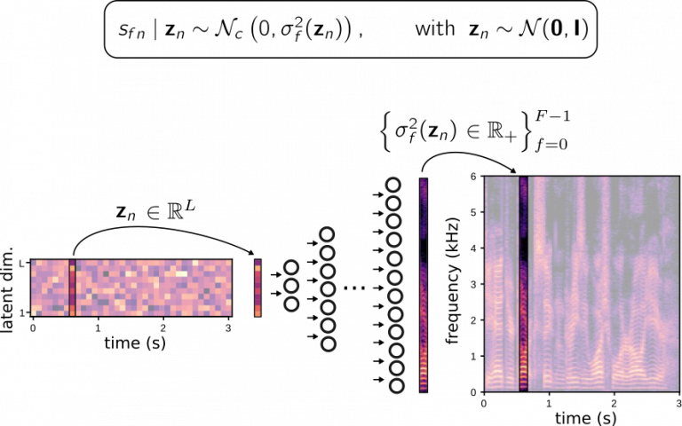
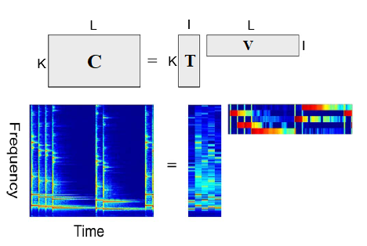

# VAE_NMF
A semi-supervised single channel speech enhancement method using Variational Autoencoder and Non-negative Matrix Factorization

## Introduction
This repository remains the same strustures as [A VARIANCE MODELING FRAMEWORK BASED ON VARIATIONAL AUTOENCODERS FOR SPEECH ENHANCEMENT](https://gitlab.inria.fr/sileglai/mlsp-2018).
We replace MCMC-EM algorithm with backpropagation-EM algorithm for performing semi-supervised speech enhancement.

We use a variance modeling framework to model the speech and noise： 
 
VAE for speech modeling 
 
NMF for noise modeling 
## Running
